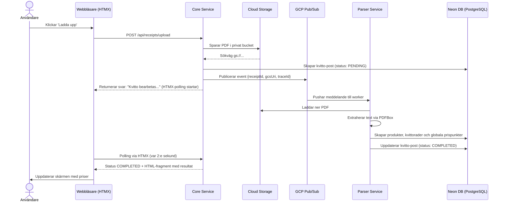
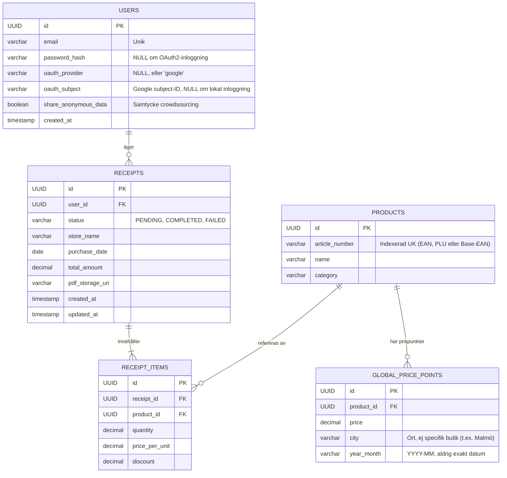

# Arkitekturdokument: Matdata 2.0

## 1. Översikt och Vision
Matdata 2.0 är en webbapplikation designad för att hjälpa konsumenter att spåra sina matkostnader på detaljnivå. Genom att ladda upp digitala PDF-kvitton, primärt från ICA via Kivra, extraherar systemet automatiskt artikelnummer (EAN/PLU), produktnamn och priser.

Systemet bygger på en modern, händelsestyrd arkitektur, anpassad för att köras serverless i Google Cloud Platform (GCP). Genom att separera användargränssnitt från tunga beräkningar garanteras hög prestanda och kostnadseffektivitet. Projektet fungerar som en referensimplementation för modern Java, molninfrastruktur och DevOps-praktiker.

## 2. Teknisk Stack & Designval

### 2.1 Backend (Distribuerad arkitektur)
Systemet är uppdelat i två separata Spring Boot-applikationer för att optimera resursanvändning och möjliggöra oberoende skalning.

* **Språk:** Java 26 med fokus på Virtual Threads, Pattern Matching och Records.
* **Core Service (Web/API):** En Spring Boot 4.x-applikation som hanterar användargränssnitt (Thymeleaf), inloggning, databasfrågor och filuppladdningar. Den konfigureras för låg minnesförbrukning och snabb responstid.
* **Parser Service (Worker):** En separat Spring Boot 4.x-applikation dedikerad till tunga operationer. Använder Apache PDFBox för textextraktion och tilldelas mer CPU/RAM för att snabbt kunna bearbeta PDF-filer i bakgrunden.
* **Meddelandekö:** Google Cloud Pub/Sub används för asynkron kommunikation mellan de två tjänsterna.
* **Observabilitet:** OpenTelemetry (OTel) används för distribuerad spårning, loggar och mätvärden över båda tjänsterna.

### 2.2 Frontend (Användargränssnitt)
* **Templating:** Thymeleaf för server-side rendering (SSR).
* **Interaktivitet:** HTMX för dynamiska DOM-uppdateringar via asynkrona anrop.
* **Styling:** Tailwind CSS för snabb, responsiv design.

### 2.3 Data och lagring
* **Databas:** Neon (serverless PostgreSQL) med stöd för branchning av databaser i test- och PR-miljöer.
* **Migrering:** Flyway för databasschema-versionering.
* **Objektlagring:** Google Cloud Storage för uppladdade PDF-kvitton.

## 3. Systemarkitektur (C4-modell)

### 3.1 Nivå 1: Systemkontext
Visar hur systemets huvudsakliga komponenter och omvärlden interagerar.

```mermaid
graph TD
    User([Användare]) -->|Interagerar via webbläsare| CoreApp[Core Service\n(Web & API)]
    Kivra([Kivra / ICA]) -.->|Levererar digitala kvitton| User

    CoreApp -->|Sparar filer| GCS[(GCP Cloud Storage)]
    CoreApp -->|Skickar event| PubSub[[GCP Pub/Sub]]
    PubSub -->|Triggar| ParserApp[Parser Service\n(Bakgrunds-worker)]

    CoreApp -->|Läser/Skriver| DB[(Neon PostgreSQL)]
    ParserApp -->|Skriver analyserat data| DB
```

### 3.2 Nivå 2: Container-arkitektur
Visar den interna uppbyggnaden av de två tjänsterna och hur OpenTelemetry syr ihop övervakningen mellan dem.

```mermaid
graph TD
    subgraph Core Service (Cloud Run)
        Web[Webblager\n(Thymeleaf & HTMX)]
        Security[Säkerhet & Auth]
        ServiceCore[Core Service Logic]
        Publisher[Pub/Sub Publisher]
    end

    subgraph Parser Service (Cloud Run)
        Subscriber[Pub/Sub Subscriber]
        Parser[PDF Parser\n(Apache PDFBox)]
        ServiceParser[Parser Service Logic]
    end

    DB[(Neon PostgreSQL)]
    GCS[(Cloud Storage)]
    OTel[OpenTelemetry\nCollector]

    Web --> Security
    Security --> ServiceCore
    ServiceCore --> Publisher
    ServiceCore --> DB
    ServiceCore --> GCS

    Publisher -.->|Skickar 'ReceiptUploaded' event| Subscriber

    Subscriber --> ServiceParser
    ServiceParser --> Parser
    ServiceParser --> DB

    ServiceCore -.->|Spårning/Loggar| OTel
    ServiceParser -.->|Spårning/Loggar| OTel
```

## 4. Kärnflöden och Databearbetning

### 4.1 Flöde: Asynkron uppladdning och bearbetning
Eftersom parsningen är asynkron får användaren ett direkt svar från gränssnittet, medan bearbetningen sker i bakgrunden.



### 4.2 Domänlogik: Hantering av viktvaror och EAN
Ett vanligt problem vid parsing av kvitton är så kallade viktvaror eller butikspackade varor, till exempel köttfärs eller ost. Dessa använder ofta EAN-13-koder där vikt eller pris är inbakat i själva streckkoden, ofta med prefix 20-29.

* **Problemet:** Om hela streckkoden sparas som `article_number` blir varje enskilt paket kött en ny produkt i systemet. Då slutar prishistoriken fungera.
* **Lösningen i Parser Service:** Parsern måste identifiera om en EAN-kod är en viktvarukod. Om ja ska parsern maskera de siffror som representerar vikt eller pris och endast returnera det basartikelnummer som unikt identifierar varan.

## 5. Databasmodell (Entity-Relationship)
Databasen använder artificiella primärnycklar (UUID `id`). För att hantera det asynkrona flödet har tabellen `RECEIPTS` en statuskolumn (`PENDING`, `COMPLETED`, `FAILED`) samt tidsstämplar för spårbarhet och felhantering.



## 6. CI/CD, Deployment och Testmiljöer
Vi tillämpar total automatisering via GitHub Actions. Eftersom lösningen ligger i ett monorepo med två tjänster, `core-service` och `parser-service`, bygger pipelinen båda.

### 6.1 Dynamiska PR-miljöer (Preview Environments)
För varje Pull Request upprättas automatiskt en isolerad testmiljö.

**Flödet för en PR:**
1. **Neon DB Branching:** GitHub Actions anropar Neon och skapar en isolerad branch av huvuddatabasen.
2. **Bygg & deploy:** Både Core Service och Parser Service byggs som Docker-images och driftsätts på Cloud Run med unika PR-specifika URL:er. De kopplas samman med ett unikt PR-Pub/Sub-topic för att förhindra krockar med produktionsdata.
3. **Teardown:** När PR:en stängs raderas de två Cloud Run-instanserna, Pub/Sub-topicet och databasbranchen automatiskt.

## 7. Säkerhet och Observabilitet

### 7.1 Autentisering & datasegregation
* Inloggning hanteras via Spring Security.
* Row-Level Security säkerställer att databasanrop som hämtar eller modifierar kvitton är strikt bundna till den inloggade användarens `user_id`.

### 7.2 Observabilitet
I en distribuerad arkitektur är övervakning extra kritiskt.

* **Distribuerad spårning:** När ett uppladdningsanrop träffar `core-service` skapas ett `trace_id`. Detta ID inkluderas i Pub/Sub-meddelandet och plockas upp av `parser-service`, så att hela flödet kan följas i samma trace.
* **Loggar och metrics:** Båda tjänsterna skickar strukturerade loggar och mätvärden kontinuerligt för larm, felsökning och kapacitetsuppföljning.

## 8. Infrastruktur som Kod (IaC)
All infrastruktur hanteras via **Terraform**.

### 8.1 Resurser som hanteras av Terraform
* **Google Cloud Platform (GCP):**
    * **Cloud Storage:** Bucket för PDF-kvitton.
    * **Cloud Pub/Sub:** Topic `receipt-uploads`, subscriptions och en separat Dead Letter Queue.
    * **Cloud Run:** Två separata tjänster. `core-service` konfigureras för snabb responstid och `parser-service` för bakgrundsbearbetning via Pub/Sub.
    * **IAM:** Separata service accounts för varje tjänst.
* **Neon (Databas):**
    * Provisionering av projekt, produktionsbranch och roller via Neons Terraform-provider.

## 9. Autentisering och Auktorisering
Autentiseringsstrategin är ännu inte slutgiltigt beslutad. Arkitekturen och datamodellen är därför designade för att stödja både lokal autentisering och OAuth2 via Google utan schemaändringar.

### 9.1 Alternativ 1: Lokal autentisering (Email + Lösenord)
* Spring Security form login används för inloggning och utloggning.
* Lösenord lagras som BCrypt-hashar i `USERS.password_hash`.
* Sessioner lagras via JDBC i PostgreSQL så att flera instanser av `core-service` kan dela sessionsstatus.
* Återställning av lösenord sker via e-postlänk, men detta ligger utanför scopet för MVP.

### 9.2 Alternativ 2: OAuth2 via Google
* Spring Security OAuth2 Client används tillsammans med `spring-boot-starter-oauth2-client`.
* Google är initial identitetsleverantör.
* Inga lösenord lagras lokalt när användaren loggar in via Google.
* En användarpost skapas automatiskt första gången någon loggar in via Google.

### 9.3 Jämförelse mellan alternativen

| Alternativ | Fördelar | Nackdelar |
| --- | --- | --- |
| Lokal autentisering | Full kontroll över inloggningsflöde, fungerar utan extern identitetsleverantör och är enkel att anpassa för egna kontoregler | Kräver hantering av lösenord, reset-flöden och större säkerhetsansvar |
| OAuth2 via Google | Snabb onboarding, inga lokala lösenord och lägre friktion för användare med Google-konto | Beroende av extern leverantör, mer OAuth-konfiguration och mindre lämpligt för användare utan Google-konto |

### 9.4 Auktorisering och dataskydd
* `USERS`-tabellen stödjer båda inloggningsmodellerna genom nullable-fält för `password_hash`, `oauth_provider` och `oauth_subject`.
* Alla databasanrop ska vara bundna till autentiserad användares `user_id` via Row-Level Security eller motsvarande skydd i datalagret.
* Eventuella framtida administrativa funktioner ska separeras från vanliga användarroller.

## 10. Felhantering och Resiliens
Systemet är designat för att tolerera fel i den asynkrona parserkedjan utan att användaren förlorar insyn i vad som hänt.

### 10.1 Parser Service kraschar mitt i jobb
Om `parser-service` kraschar mitt under bearbetningen hinner meddelandet inte ackas i Pub/Sub. När ack-deadline löper ut levereras meddelandet igen. Ack-deadline är konfigurerbar och är som standard 10 minuter. Kvitto-postens status ligger kvar som `PENDING` tills en ny bearbetning lyckas eller processen flyttas till DLQ.

### 10.2 Dead Letter Queue (DLQ)
Efter ett konfigurerat antal misslyckade försök, exempelvis 5, flyttas meddelandet till topicet `receipt-uploads-dlq` för manuell inspektion och felsökning.

### 10.3 Synligt fel för användaren
När ett meddelande hamnar i DLQ ska en separat hanterare uppdatera kvittot till status `FAILED`. På så sätt ser användaren i gränssnittet att bearbetningen inte lyckades och att kvittot behöver laddas upp på nytt eller granskas manuellt.

### 10.4 Städning i Cloud Storage
Om parsning misslyckas permanent ska den uppladdade PDF-filen till slut rensas bort av ett schemalagt jobb, så att lagringen inte växer okontrollerat.

### 10.5 Idempotens
För att undvika dubbletter måste parsern alltid kontrollera om ett kvitto redan har status `COMPLETED` innan bearbetning påbörjas. Om kvittot redan är klart ska meddelandet betraktas som redan hanterat.

## 11. Secrets och Miljövariabler

### 11.1 Lokal utveckling
* Lokalt används en `.env`-fil som **aldrig** committas och därför ska ligga i `.gitignore`.
* Spring Boot läser in filen via `spring.config.import=optional:file:.env[.properties]`.
* Utvecklare fyller själva i lokala värden för databas, GCP och vald autentiseringsmetod.

### 11.2 CI/CD
* GitHub Secrets används för känsliga värden i pipelines.
* GCP-access i GitHub Actions ska ske via Workload Identity Federation så att långlivade service account-nycklar inte behöver lagras.
* Miljövariabler injiceras vid build eller deploy till respektive Cloud Run-tjänst.

### 11.3 Miljövariabler

| Variabel | Beskrivning |
| --- | --- |
| `SPRING_PROFILES_ACTIVE` | Aktiv Spring-profil, till exempel `local`, `dev`, `pr` eller `prod`. |
| `DATABASE_URL` | JDBC- eller Postgres-anslutningssträng till Neon/PostgreSQL. |
| `DATABASE_USERNAME` | Databasanvändare. |
| `DATABASE_PASSWORD` | Databaslösenord. |
| `GCP_PROJECT_ID` | GCP-projektets ID. |
| `GCS_BUCKET_NAME` | Bucket för uppladdade PDF-kvitton. |
| `PUBSUB_TOPIC_RECEIPT_UPLOADS` | Topic för nya uppladdade kvitton. |
| `PUBSUB_SUBSCRIPTION_RECEIPT_UPLOADS` | Subscription som `parser-service` konsumerar från. |
| `PUBSUB_TOPIC_RECEIPT_UPLOADS_DLQ` | Topic för meddelanden som gått till DLQ. |
| `GOOGLE_CLIENT_ID` | OAuth2-klient-ID för Google-inloggning. Krävs endast om OAuth2 används. |
| `GOOGLE_CLIENT_SECRET` | OAuth2-klienthemlighet för Google-inloggning. Krävs endast om OAuth2 används. |
| `APP_BASE_URL` | Bas-URL för callback-URL:er, länkar och eventuella e-postflöden. |
| `OTEL_EXPORTER_OTLP_ENDPOINT` | Endpoint för export av tracing och metrics via OpenTelemetry. |

## 12. Monorepo-struktur

```text
matdata/
├── core-service/          # Spring Boot Web/API-tjänst
├── parser-service/        # Spring Boot Worker-tjänst
├── terraform/             # All infrastruktur som kod
│   ├── main.tf
│   ├── variables.tf
│   └── modules/
│       ├── gcp/
│       └── neon/
├── documentation/         # Projektdokumentation
└── .github/
    └── workflows/         # CI/CD-pipelines
```
