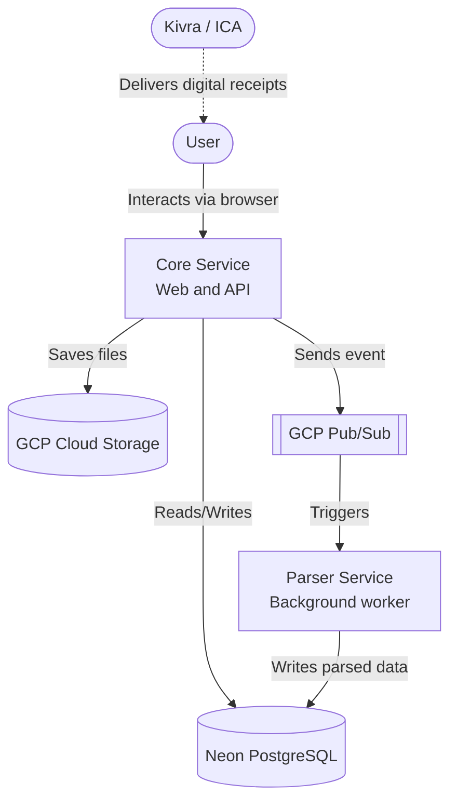
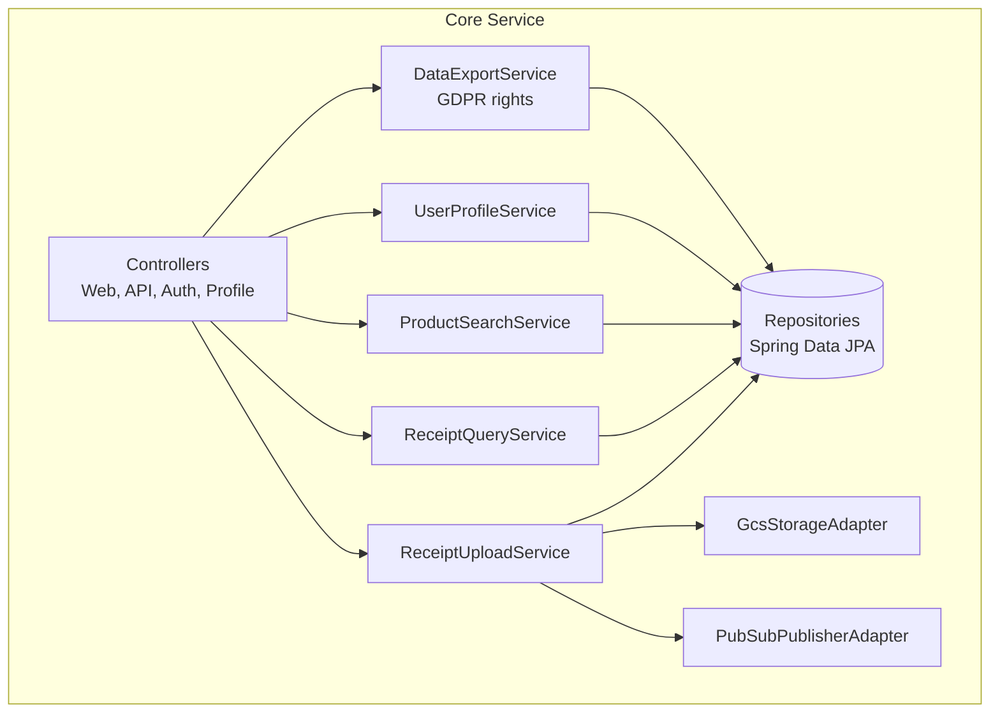
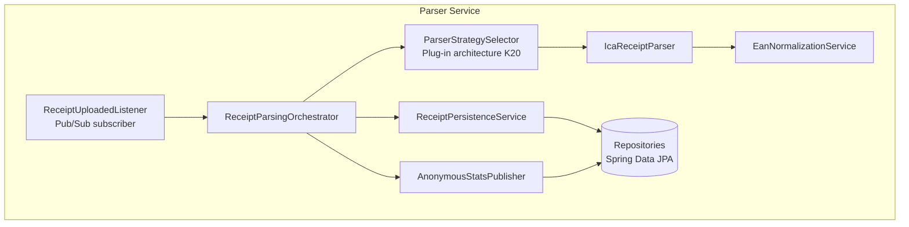
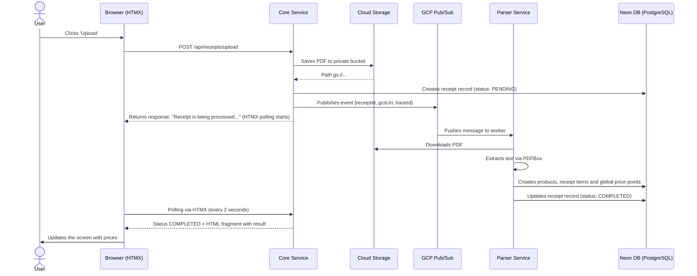
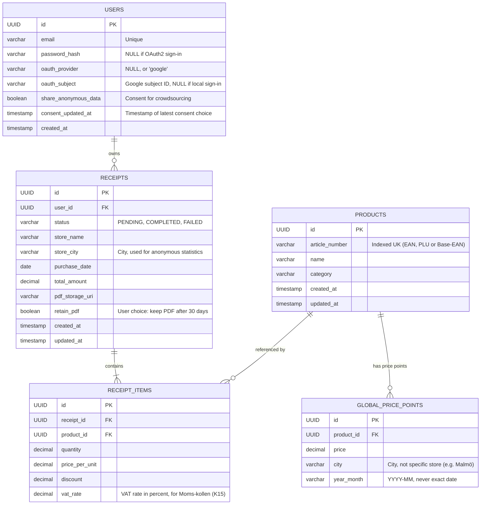

# Architecture document: Matdata 2.0

| Metadata | |
| --- | --- |
| Version | 1.0 |
| Last updated | 2026-06-29 |
| Status | Pre-study ready for review |
| Place in documentation | Technical architecture. Read after [prestudy.md](prestudy.md). |

> This is the architecture document. For the requirements matrix, see [project-plan_requirements.md](project-plan_requirements.md). For non-functional requirements (performance, security, accessibility), see [non-functional-requirements.md](non-functional-requirements.md). Other documents are listed in [README.md](README.md).

## Contents
- [1. Overview and vision](#overview)
- [2. Technical stack and design choices](#stack)
- [3. System architecture (C4 model)](#c4)
- [4. Core flows and data processing](#flow)
- [5. Database model](#database)
- [6. CI/CD, deployment and test environments](#cicd)
- [7. Security and observability](#security)
- [8. Infrastructure as code (IaC)](#iac)
- [9. Authentication and authorisation](#auth)
- [10. Error handling and resilience](#resilience)
- [11. Secrets and environment variables](#secrets)
- [12. Search architecture](#search)
- [13. Backup and disaster recovery](#backup)
- [14. Monorepo structure](#monorepo)

## 1. Overview and vision <a name="overview"></a>
Matdata 2.0 is a web application designed to help consumers track their food costs in detail. By uploading digital PDF receipts, primarily from ICA via Kivra, the system automatically extracts article numbers (EAN/PLU), product names and prices.

The system is built on a modern, event-driven architecture, tailored to run serverless on Google Cloud Platform (GCP). By separating the user interface from heavy computation, high performance and cost-efficiency are guaranteed. The project serves as a reference implementation for modern Java, cloud infrastructure and DevOps practices.

## 2. Technical stack and design choices <a name="stack"></a>

### 2.1 Back end (distributed architecture)
The system is split into two separate Spring Boot applications in order to optimise resource usage and allow independent scaling.

* **Language:** Java 26 with a focus on Virtual Threads, Pattern Matching and Records.
* **Core Service (web/API):** A Spring Boot 4.x application that handles the user interface (Thymeleaf), sign-in, database queries and file uploads. It is configured for low memory usage and fast response times.
* **Parser Service (worker):** A separate Spring Boot 4.x application dedicated to heavy operations. Uses Apache PDFBox for text extraction and is allocated more CPU/RAM in order to process PDF files quickly in the background.
* **Message queue:** Google Cloud Pub/Sub is used for asynchronous communication between the two services.
* **Observability:** OpenTelemetry (OTel) is used for distributed tracing, logs and metrics across both services.

### 2.2 Front end (user interface)
* **Templating:** Thymeleaf for server-side rendering (SSR).
* **Interactivity:** HTMX for dynamic DOM updates via asynchronous calls.
* **Styling:** Tailwind CSS for fast, responsive design.
* **Chart library:** Decision pending (see ADR-011 in [open-decisions.md](open-decisions.md)).

### 2.3 Data and storage
* **Database:** Neon (serverless PostgreSQL) with support for branching of databases in test and PR environments.
* **Migration:** Flyway for database-schema versioning.
* **Object storage:** Google Cloud Storage for uploaded PDF receipts. A lifecycle policy deletes PDFs after 30 days by default (see ADR-008 in [open-decisions.md](open-decisions.md) and [non-functional-requirements.md](non-functional-requirements.md) NFR-D1).

## 3. System architecture (C4 model) <a name="c4"></a>

### 3.1 Level 1: System context
Shows how the system's main components and the outside world interact.



### 3.2 Level 2: Container architecture
Shows the internal structure of the two services and how OpenTelemetry stitches the monitoring together between them.

```mermaid
graph TD
    subgraph Core Service (Cloud Run)
        Web[Web layer<br/>Thymeleaf and HTMX]
        Security[Security and Auth]
        ServiceCore[Core Service Logic]
        Publisher[Pub/Sub Publisher]
    end

    subgraph Parser Service (Cloud Run)
        Subscriber[Pub/Sub Subscriber]
        Parser[PDF Parser<br/>Apache PDFBox]
        ServiceParser[Parser Service Logic]
    end

    DB[(Neon PostgreSQL)]
    GCS[(Cloud Storage)]
    OTel[OpenTelemetry<br/>Collector]

    Web --> Security
    Security --> ServiceCore
    ServiceCore --> Publisher
    ServiceCore --> DB
    ServiceCore --> GCS

    Publisher -.->|Sends 'ReceiptUploaded' event| Subscriber

    Subscriber --> ServiceParser
    ServiceParser --> Parser
    ServiceParser --> DB

    ServiceCore -.->|Tracing/Logs| OTel
    ServiceParser -.->|Tracing/Logs| OTel
```

### 3.3 Level 3: Components in Core Service
Shows the most important components inside `core-service` and their responsibilities.



### 3.4 Level 3: Components in Parser Service
Shows the Parser Service split into ingestion, parsing and persistence.



## 4. Core flows and data processing <a name="flow"></a>

### 4.1 Flow: Asynchronous upload and processing
Because the parsing is asynchronous, the user gets an immediate response from the interface while the processing happens in the background.



### 4.2 Domain logic: Handling weight items and EAN
A common problem when parsing receipts is the so-called weight items or store-packed items, e.g. minced meat or cheese. These often use EAN-13 codes where weight or price is embedded in the barcode itself, typically with prefix 20–29.

* **The problem:** If the entire barcode is stored as `article_number`, every single pack of meat becomes a new product in the system. The price history then stops working.
* **The solution in Parser Service:** The parser must identify whether an EAN code is a weight-item code. If so, the parser must mask the digits that represent weight or price and only return the base article number that uniquely identifies the item.

## 5. Database model <a name="database"></a>

The database uses artificial primary keys (UUID `id`). To handle the asynchronous flow, the `RECEIPTS` table has a status column (`PENDING`, `COMPLETED`, `FAILED`) as well as timestamps for traceability and error handling.

`RECEIPT_ITEMS` includes `vat_rate` so that thematic analysis views like "Moms-kollen" (requirement K15) can calculate the effect of VAT changes. `PRODUCTS` has `created_at` and `updated_at` for auditability and to be able to detect new products over time.



The aggregation in `GLOBAL_PRICE_POINTS` uses city and month. The decision is documented in ADR-007 in [open-decisions.md](open-decisions.md) and substantiated in [dpia.md](dpia.md).

## 6. CI/CD, deployment and test environments <a name="cicd"></a>

We apply full automation via GitHub Actions. Because the solution lives in a monorepo with two services, `core-service` and `parser-service`, the pipeline builds both.

### 6.1 Dynamic PR environments (preview environments)
For every Pull Request, an isolated test environment is automatically created.

**The flow for a PR:**
1. **Neon DB branching:** GitHub Actions calls Neon and creates an isolated branch of the main database.
2. **Build and deploy:** Both Core Service and Parser Service are built as Docker images and deployed to Cloud Run with unique PR-specific URLs. They are wired together with a unique PR Pub/Sub topic to prevent collisions with production data.
3. **Teardown:** When the PR is closed, the two Cloud Run instances, the Pub/Sub topic and the database branch are deleted automatically.

### 6.2 Security measures in the pipeline
* Dependency scanning via Dependabot or Renovate (NFR-SEC6).
* Static code analysis via GitHub CodeQL (NFR-SEC7).
* Secrets via Workload Identity Federation (NFR-SEC8).
* Container scanning of built images.

## 7. Security and observability <a name="security"></a>

### 7.1 Authentication and data segregation
* Sign-in is handled via Spring Security. Details in section 9.
* Row-Level Security ensures that database calls that read or modify receipts are strictly bound to the signed-in user's `user_id`.

### 7.2 Observability
In a distributed architecture, monitoring is particularly critical. Measurable goals are gathered in [non-functional-requirements.md](non-functional-requirements.md) section 6.

* **Distributed tracing:** When an upload request hits `core-service`, a `trace_id` is created. This ID is included in the Pub/Sub message and is picked up by `parser-service`, so that the entire flow can be followed in the same trace.
* **Logs and metrics:** Both services send structured logs and metrics continuously, for alerting, troubleshooting and capacity planning.
* **PII filtering:** Logs must not contain e-mail addresses, passwords or full receipt content. Logback masks are used.

## 8. Infrastructure as code (IaC) <a name="iac"></a>

All infrastructure is managed via **Terraform**.

### 8.1 Resources managed by Terraform
* **Google Cloud Platform (GCP):**
    * **Cloud Storage:** Bucket for PDF receipts (private, lifecycle policy for 30-day retention).
    * **Cloud Pub/Sub:** Topic `receipt-uploads`, subscriptions and a separate Dead Letter Queue.
    * **Cloud Run:** Two separate services. `core-service` is configured for fast response times and `parser-service` for background processing via Pub/Sub.
    * **IAM:** Separate service accounts for each service. Workload Identity Federation for GitHub Actions.
    * **Cloud Monitoring:** Alerting policies tied to the SLOs in [non-functional-requirements.md](non-functional-requirements.md).
* **Neon (database):**
    * Provisioning of project, production branch and roles via Neon's Terraform provider.
    * Budget alerts for storage and compute hours.

## 9. Authentication and authorisation <a name="auth"></a>

The authentication strategy is decided in ADR-009 in [open-decisions.md](open-decisions.md). **Local authentication** is used in the MVP, and **OAuth2 via Google** is added as a complementary sign-in path in a later iteration. The data model in section 5 is prepared for both.

### 9.1 MVP: local authentication (e-mail and password)
* Spring Security form login is used for sign-in and sign-out.
* Passwords are stored as BCrypt hashes in `USERS.password_hash` with a cost of ≥ 12 (NFR-SEC4).
* Sessions are stored via JDBC in PostgreSQL so that multiple instances of `core-service` can share session state.
* The session cookie is `HttpOnly`, `Secure`, `SameSite=Lax`.
* Session regeneration runs after sign-in (NFR-SEC5).
* Rate limiting on authentication endpoints (NFR-SEC10).
* Password reset is via e-mail link; activated post-MVP (see ADR-015 in [open-decisions.md](open-decisions.md)).

### 9.2 Post-MVP: OAuth2 via Google
* Spring Security OAuth2 Client is used together with `spring-boot-starter-oauth2-client`.
* Google is the initial identity provider.
* No passwords are stored locally when the user signs in via Google.
* A user record is created automatically the first time someone signs in via Google.

### 9.3 Comparison of the alternatives

| Alternative | Pros | Cons |
| --- | --- | --- |
| Local authentication (MVP) | Full control over sign-in flow, works without an external identity provider and is easy to adapt to custom account rules | Requires handling of passwords, reset flows and greater security responsibility |
| OAuth2 via Google (post-MVP) | Fast onboarding, no local passwords and lower friction for users with a Google account | Dependent on an external provider, more OAuth configuration and less suitable for users without a Google account |

### 9.4 Authorisation and data protection
* The `USERS` table supports both sign-in models through nullable fields for `password_hash`, `oauth_provider` and `oauth_subject`.
* All database calls must be bound to the authenticated user's `user_id` via Row-Level Security or equivalent protection in the data layer.
* Any future administrative functions must be separated from regular user roles.
* Audit logs for consent and sign-in events, see [non-functional-requirements.md](non-functional-requirements.md) NFR-D6.

## 10. Error handling and resilience <a name="resilience"></a>

The system is designed to tolerate failures in the asynchronous parser chain without the user losing visibility into what happened.

### 10.1 Parser Service crashes mid-job
If `parser-service` crashes during processing, the message does not get acked in Pub/Sub. When the ack deadline expires, the message is delivered again. The ack deadline is configurable and is 10 minutes by default. The receipt record stays as `PENDING` until a new processing run succeeds or the process moves to the DLQ.

### 10.2 Dead Letter Queue (DLQ)
After a configured number of failed attempts, e.g. 5, the message is moved to the topic `receipt-uploads-dlq` for manual inspection and troubleshooting. DLQ traffic > 0 must trigger an alert within 5 minutes (NFR-A4).

### 10.3 Visible failure for the user
When a message lands in the DLQ, a separate handler must update the receipt to status `FAILED`. That way the user sees in the interface that the processing did not succeed and that the receipt needs to be uploaded again or reviewed manually.

### 10.4 Clean-up in Cloud Storage
If parsing fails permanently, the uploaded PDF file must eventually be cleared away by a scheduled job, so that storage does not grow uncontrolled. The default lifecycle policy deletes PDFs after 30 days (NFR-D1).

### 10.5 Idempotency
To avoid duplicates, the parser must always check whether a receipt already has status `COMPLETED` before starting to process. If the receipt is already complete, the message must be regarded as already handled.

## 11. Secrets and environment variables <a name="secrets"></a>

### 11.1 Local development
* Locally a `.env` file is used, which is **never** committed and must therefore be in `.gitignore`.
* Spring Boot reads the file via `spring.config.import=optional:file:.env[.properties]`.
* Developers fill in local values for database, GCP and chosen authentication method themselves.

### 11.2 CI/CD
* GitHub Secrets is used for sensitive values in pipelines.
* GCP access in GitHub Actions must go through Workload Identity Federation so that long-lived service account keys do not have to be stored.
* Environment variables are injected at build or deploy time into the respective Cloud Run service.

### 11.3 Environment variables

| Variable | Description |
| --- | --- |
| `SPRING_PROFILES_ACTIVE` | Active Spring profile, for example `local`, `dev`, `pr` or `prod`. |
| `DATABASE_URL` | JDBC or Postgres connection string to Neon/PostgreSQL. |
| `DATABASE_USERNAME` | Database user. |
| `DATABASE_PASSWORD` | Database password. |
| `GCP_PROJECT_ID` | The GCP project's ID. |
| `GCS_BUCKET_NAME` | Bucket for uploaded PDF receipts. |
| `PUBSUB_TOPIC_RECEIPT_UPLOADS` | Topic for newly uploaded receipts. |
| `PUBSUB_SUBSCRIPTION_RECEIPT_UPLOADS` | Subscription that `parser-service` consumes from. |
| `PUBSUB_TOPIC_RECEIPT_UPLOADS_DLQ` | Topic for messages that have gone to the DLQ. |
| `GOOGLE_CLIENT_ID` | OAuth2 client ID for Google sign-in. Required only if OAuth2 is used (post-MVP). |
| `GOOGLE_CLIENT_SECRET` | OAuth2 client secret for Google sign-in. Required only if OAuth2 is used (post-MVP). |
| `APP_BASE_URL` | Base URL for callback URLs, links and any e-mail flows. |
| `OTEL_EXPORTER_OTLP_ENDPOINT` | Endpoint for exporting tracing and metrics via OpenTelemetry. |
| `PDF_RETENTION_DAYS` | Number of days a PDF is stored before automatic deletion. Default 30. |

## 12. Search architecture <a name="search"></a>

The user must be able to look up products via autocomplete (UX vision section 2.3). NFR-P4 sets the latency requirement to < 200 ms p95.

### 12.1 MVP implementation
* Back-end endpoint: `GET /api/search?q=...`.
* The query runs against `PRODUCTS.name` with a PostgreSQL `ILIKE` prefix search, complemented with `LIMIT 10` and sorting by popularity (number of `RECEIPT_ITEMS` per product).
* Index: `CREATE INDEX idx_products_name_lower ON PRODUCTS (LOWER(name) text_pattern_ops);` for an efficient prefix search.
* Results are returned as a Thymeleaf fragment and rendered in the autocomplete list via HTMX.

### 12.2 Scaling path (post-MVP)
If the dataset or latency requirements grow, `pg_trgm` for fuzzy matching is evaluated, followed possibly by a dedicated search engine (see ADR-012 in [open-decisions.md](open-decisions.md)).

## 13. Backup and disaster recovery <a name="backup"></a>

* **Database:** Neon takes daily snapshots with 14-day retention (NFR-D8). RPO ≤ 24 h, RTO ≤ 4 h (NFR-B1, NFR-B2).
* **Cloud Storage:** The original receipt is regarded as non-critical data. The user is asked to keep the original in Kivra (NFR-B3).
* **Infrastructure:** The entire environment can be recreated from Terraform in a new GCP/Neon instance (NFR-B5).
* **Recovery test:** At least one successful recovery from a snapshot per quarter (NFR-B4).

## 14. Monorepo structure <a name="monorepo"></a>

The repo name on GitHub is `matdata-monorepo` (see ADR-010 in [open-decisions.md](open-decisions.md)).

```text
matdata-monorepo/
├── core-service/          # Spring Boot Web/API service
├── parser-service/        # Spring Boot Worker service
├── terraform/             # All infrastructure as code
│   ├── main.tf
│   ├── variables.tf
│   └── modules/
│       ├── gcp/
│       └── neon/
├── documentation/         # Project documentation (this pre-study + future technical documents)
└── .github/
    └── workflows/         # CI/CD pipelines
```
